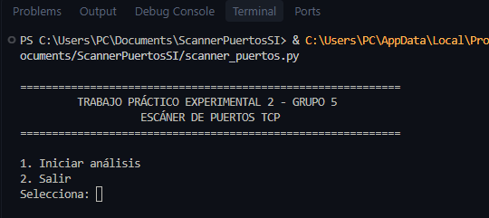
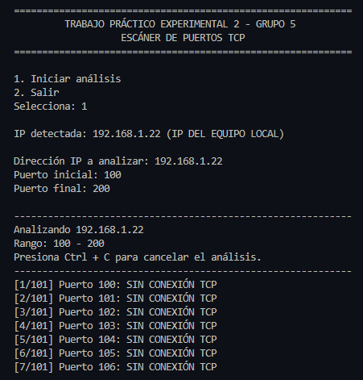
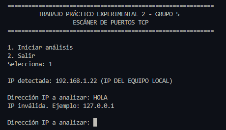
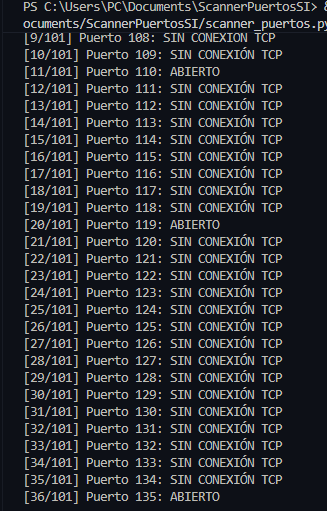
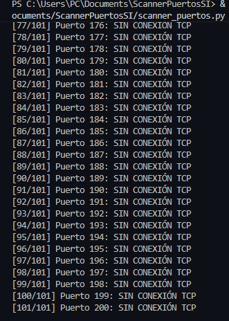
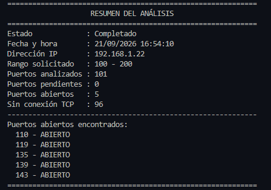
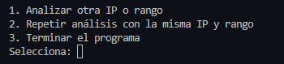
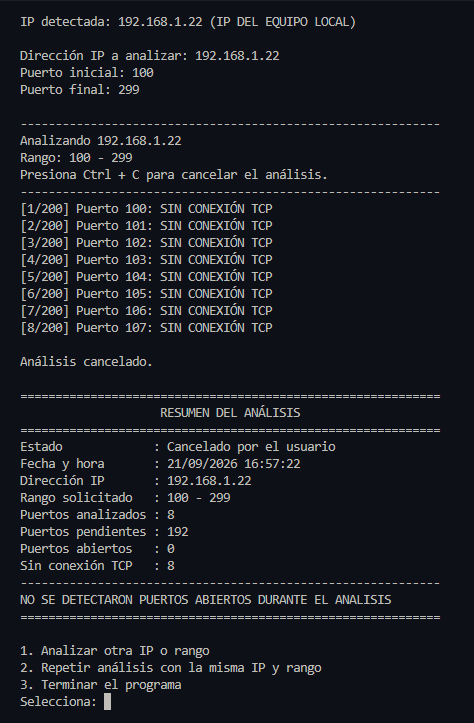
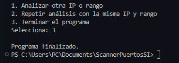

# Manual de uso del escáner de puertos TCP

**Trabajo Práctico Experimental 2 - Grupo 5**  
**Asignatura: Seguridad Informática**

## 1. Descripción

El escáner permite comprobar qué puertos TCP de un equipo aceptan conexiones. Para utilizarlo, el usuario ingresa una dirección IPv4 y selecciona un puerto inicial y uno final.

Durante el análisis se muestra el resultado de cada intento. Al finalizar, aparece un resumen con los puertos analizados y la lista de puertos abiertos.

El programa también permite cancelar el análisis, repetirlo con los mismos datos o ingresar una nueva IP y rango.

Las pruebas deben realizarse en equipos propios o entornos autorizados.

## 2. Requisitos para ejecutar el programa

Se necesita:

- Una computadora con Python 3 instalado.
- El archivo `scanner_puertos.py`.
- Visual Studio Code para seguir este manual.
- Acceso al equipo que se desea analizar.

El programa utiliza `socket`, `ipaddress` y `datetime`. Estas bibliotecas están incluidas en Python, por lo que no es necesario instalar paquetes adicionales.

Se requiere Internet para descargar las herramientas y el proyecto. Para analizar la propia computadora no es necesario tener acceso a Internet.

Las instrucciones de este manual están orientadas a Windows.

## 3. Instalación y preparación

1. Instalar Python 3 desde https://www.python.org/downloads/.
2. Instalar Visual Studio Code desde https://code.visualstudio.com/.
3. Descargar el proyecto desde su repositorio de GitHub mediante **Code → Download ZIP**.
4. Extraer el archivo ZIP.
5. Abrir Visual Studio Code.
6. Seleccionar **Archivo → Abrir carpeta** y elegir la carpeta que contiene `scanner_puertos.py`.
7. Abrir **Terminal → Nueva terminal**.

Comprobar que Python esté disponible con el siguiente comando:

```powershell
py --version
```

Debe aparecer una versión de Python 3.

Si el comando `py` no funciona, probar:

```powershell
python --version
```

Si funciona `python`, utilizarlo en lugar de `py` en las instrucciones siguientes. Si ninguno funciona, revisar la instalación de Python y volver a abrir Visual Studio Code.

## 4. Cómo iniciar la aplicación

En la terminal, ubicada en la carpeta del proyecto, ejecutar:

```powershell
py scanner_puertos.py
```

Aparecerá el encabezado del trabajo y el menú inicial:

- **1. Iniciar análisis:** solicita la IP y el rango de puertos.
- **2. Salir:** termina el programa.

Escribir `1` y presionar Enter para comenzar.



## 5. Cómo ingresar la IP

El programa muestra una dirección detectada con la etiqueta **(IP DEL EQUIPO LOCAL)**. Esta información sirve como referencia; el usuario debe escribir la dirección que desea analizar.

En el campo **Dirección IP a analizar**, ingresar una IPv4 válida y presionar Enter.

En la prueba mostrada se utilizó `192.168.1.22`, correspondiente al equipo de esa sesión. Esta dirección puede ser diferente en otra computadora o cambiar al conectarse a otra red.

Si existen varias conexiones activas o una VPN, la IP detectada puede corresponder a otra interfaz. Para comprobarla en Windows, ejecutar `ipconfig` y revisar la IPv4 del adaptador utilizado.

También se puede ingresar `127.0.0.1` para analizar la computadora donde se está ejecutando el programa.

Si se escribe una dirección con formato incorrecto, el programa solicita corregirla.

## 6. Cómo seleccionar el rango de puertos

Después de ingresar la IP, completar los siguientes campos:

1. **Puerto inicial:** primer puerto que se revisará.
2. **Puerto final:** último puerto que se revisará.

Los valores deben ser números enteros entre 1 y 65535. El puerto final debe ser mayor o igual que el inicial.

En el ejemplo se ingresó:

| Campo | Valor |
|---|---|
| Dirección IP | 192.168.1.22 |
| Puerto inicial | 100 |
| Puerto final | 200 |

Este rango incluye **101 puertos**, porque se cuentan tanto el puerto 100 como el 200.

Si el usuario ingresa letras, valores fuera del límite o un rango invertido, el programa solicita corregir el dato.





## 7. Cómo ejecutar el escaneo

El escaneo comienza automáticamente después de ingresar un puerto final válido y presionar Enter.

Cada línea muestra el avance, el puerto revisado y el resultado del intento de conexión.

Por ejemplo:

```text
[11/101] Puerto 110: ABIERTO
```

Esto indica que se han registrado 11 intentos de los 101 previstos y que el puerto 110 aceptó la conexión TCP.



El programa continúa hasta completar el rango, a menos que el usuario lo cancele o se produzca un error que detenga el proceso.

La última línea de la prueba muestra `[101/101]`, correspondiente al puerto 200.



## 8. Cómo interpretar los resultados

Durante el escaneo pueden aparecer estos mensajes:

| Mensaje | Significado |
|---|---|
| ABIERTO | Se logró establecer una conexión TCP con el puerto. |
| SIN CONEXIÓN TCP | No se logró establecer la conexión durante ese intento. Puede deberse a un puerto cerrado, filtros o falta de respuesta. |

Un puerto abierto no demuestra por sí solo que exista una vulnerabilidad. El programa tampoco identifica qué aplicación está utilizando ese puerto.

Al finalizar aparece el resumen:

| Campo | Qué representa |
|---|---|
| Estado | Indica si el análisis se completó, fue cancelado o se detuvo por un error. |
| Fecha y hora | Momento en que comenzó el análisis. |
| Dirección IP | Dirección ingresada por el usuario. |
| Rango solicitado | Puertos inicial y final seleccionados. |
| Puertos analizados | Intentos de conexión que terminaron y fueron registrados. |
| Puertos pendientes | Puertos del rango que no quedaron registrados como analizados. |
| Puertos abiertos | Cantidad de conexiones establecidas correctamente. |
| Sin conexión TCP | Cantidad de intentos registrados que no establecieron conexión. |

En la prueba completada se obtuvieron estos resultados:

| Elemento | Resultado |
|---|---|
| IP utilizada | 192.168.1.22 |
| Rango solicitado | 100–200 |
| Puertos analizados | 101 |
| Puertos pendientes | 0 |
| Puertos abiertos | 5 |
| Sin conexión TCP | 96 |
| Lista de abiertos | 110, 119, 135, 139 y 143 |

Estos resultados corresponden a la prueba mostrada. Pueden variar según el equipo, los servicios activos y las condiciones de la red.



## 9. Opciones después del análisis

Al terminar, el programa muestra tres opciones:

| Opción | Función |
|---|---|
| 1. Analizar otra IP o rango | Solicita nuevamente la IP y los puertos inicial y final. |
| 2. Repetir análisis con la misma IP y rango | Ejecuta un nuevo escaneo completo utilizando los datos anteriores. |
| 3. Terminar el programa | Finaliza la aplicación. |

Escribir el número de la opción y presionar Enter.

La opción 2 comienza desde el puerto inicial. No continúa desde el punto donde se canceló un análisis anterior.



## 10. Cómo cancelar un análisis

Mientras se revisan los puertos, presionar **Ctrl + C** una vez.

El programa detiene el escaneo y presenta los resultados obtenidos hasta ese momento. El estado aparece como **Cancelado por el usuario**.

En Visual Studio Code, la terminal debe estar activa y sin texto seleccionado para que Ctrl + C no se interprete como copiar.

En la prueba de cancelación se utilizó el rango de 100 a 299, que contiene 200 puertos. El análisis se detuvo después de registrar 8 intentos, por lo que quedaron 192 pendientes.

No se detectaron puertos abiertos en esos 8 intentos. Por esa razón apareció el mensaje:

```text
NO SE DETECTARON PUERTOS ABIERTOS DURANTE EL ANALISIS
```

Este resultado se refiere únicamente a la parte analizada. No permite conocer el estado de los puertos pendientes.



Si se presiona Ctrl + C mientras se ingresan datos o se está en un menú, el programa termina.

## 11. Cómo terminar el programa

Después de un análisis, seleccionar **3. Terminar el programa** y presionar Enter.

Aparecerá el mensaje:

```text
Programa finalizado.
```

La terminal quedará disponible para escribir otros comandos.

También se puede salir desde el menú inicial seleccionando la opción 2.



## 12. Problemas frecuentes

| Situación | Qué hacer |
|---|---|
| No se reconoce `py` | Probar con `python` y comprobar que Python esté instalado. |
| No se encuentra el archivo del programa | Verificar que la terminal esté en la carpeta que contiene `scanner_puertos.py`. |
| No se detecta la IP local | Consultar `ipconfig` e ingresar manualmente la dirección del equipo. |
| No aparecen puertos abiertos | Revisar la IP, el rango y si hay servicios escuchando. No implica necesariamente un error del programa. |
| El escaneo tarda | Considerar que se revisan los puertos uno por uno, con una espera configurada de 0,5 segundos por conexión. |
| Ctrl + C copia texto | Quitar la selección de texto y activar la terminal antes de presionar la combinación. |